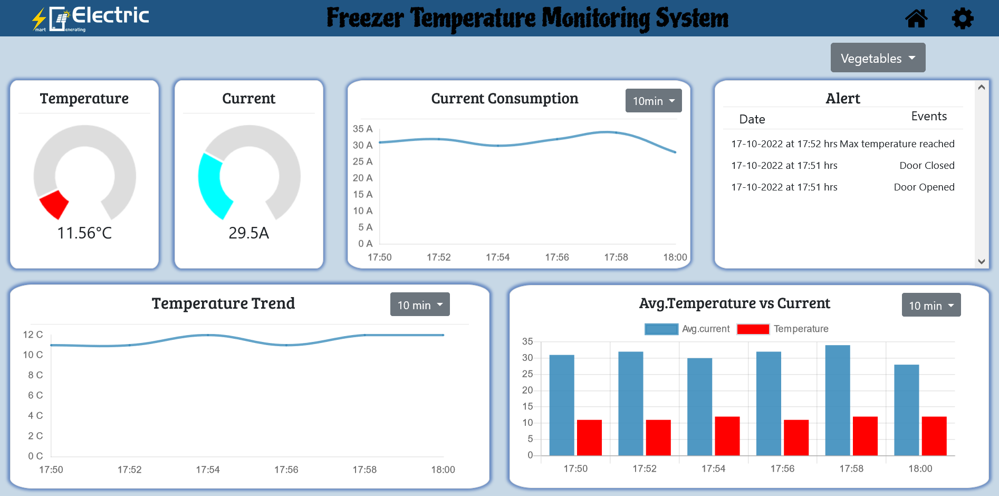
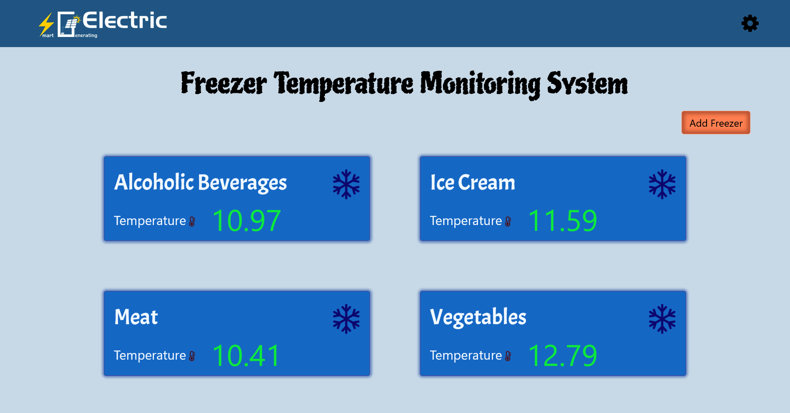
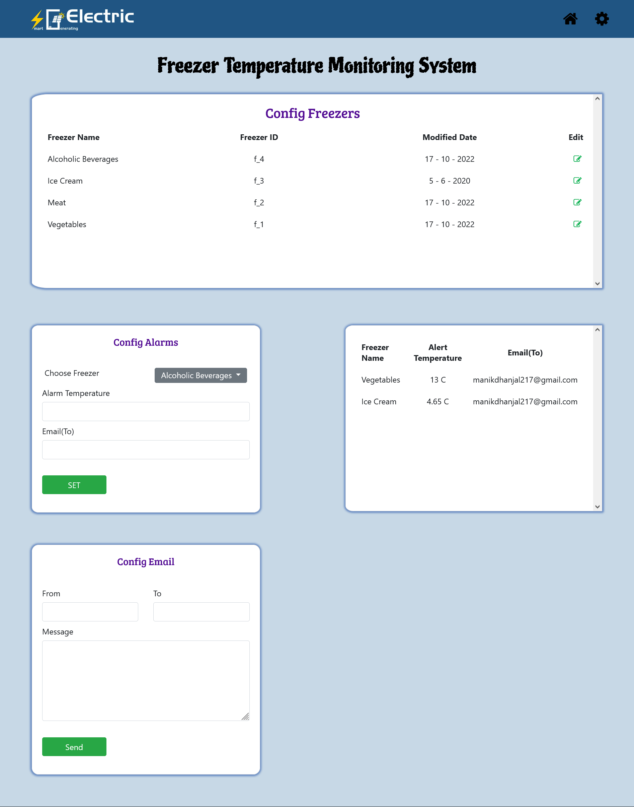

# Freezer Monitoring System

Freezer Monitoring System is a Dashboard for observing stats, log and display the alert of individual freezers. It fetchs stats of freezers from SQL Database which get updated every minute.

## Usage
- It can display the temperature, current and alerts of selected freezer in line graphs, bar graphs and charts.
- Arduino will insert stats in live_records table in SQL database which in turn will be displayed on dashboard.
- Dashboard can show alert message of particular freezers ex- Temperature reached below 12 C.
- We can set a minimum temperature Alarm in settings to add message to alert box whenever temperature reaches below 12C.
## Tech Stack
- <b>Node.js</b> is used as Javascript runtime envoirnment.
- <b>express.js</b> for handling http based requests.
- <b>ejs</b> for generating HTML markup with plain JavaScript.
- <b>MySQL</b> for storing freezer stats and alerts.
- <b>Chart.js</b> for drawing bar graphs, line graphs and dougnut charts on frontend.
- <b>AJAX</b> is used in frontend for fetching stats of freezer in realtime without loading the page.

## Screenshots

